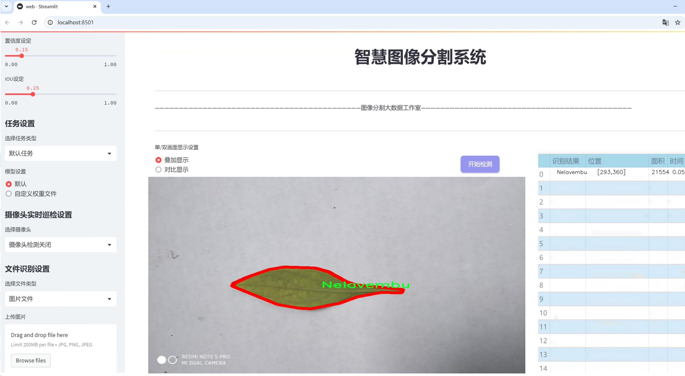
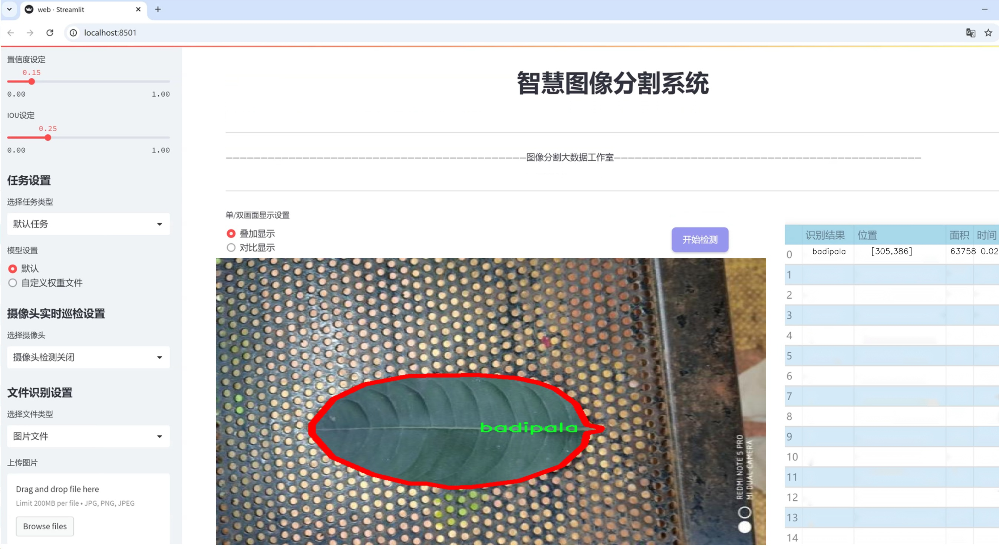
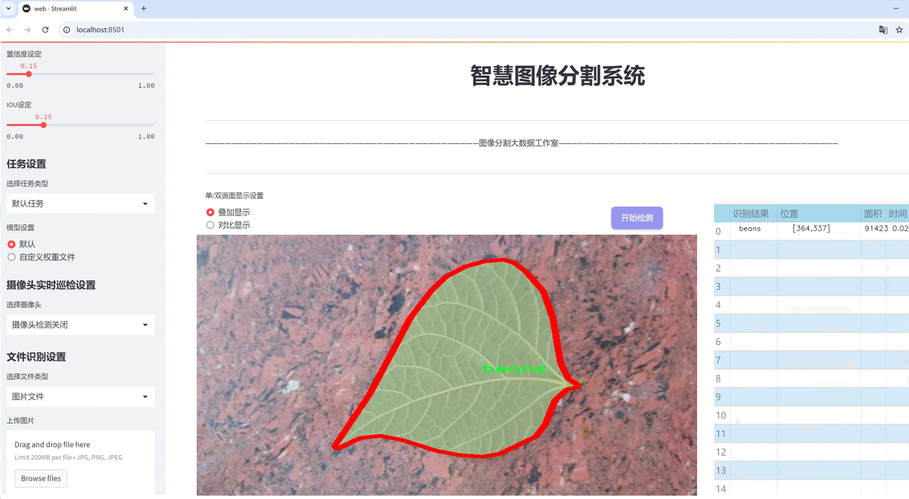
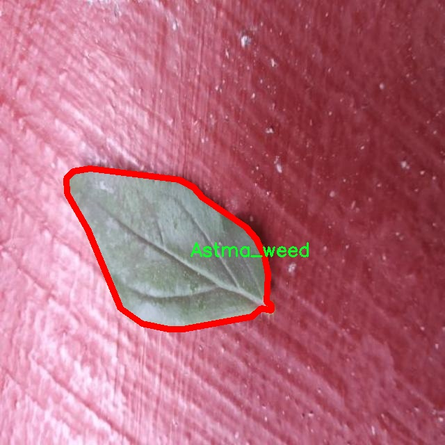
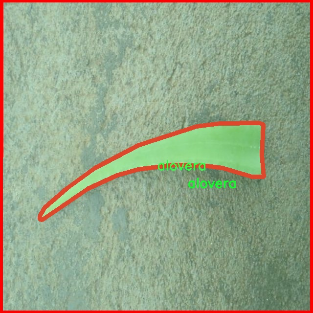
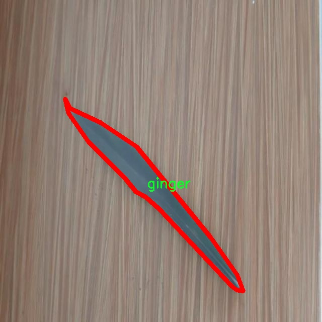
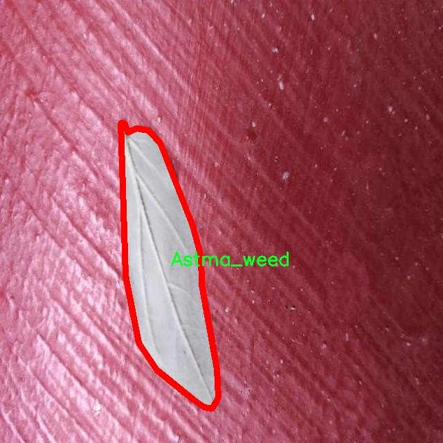
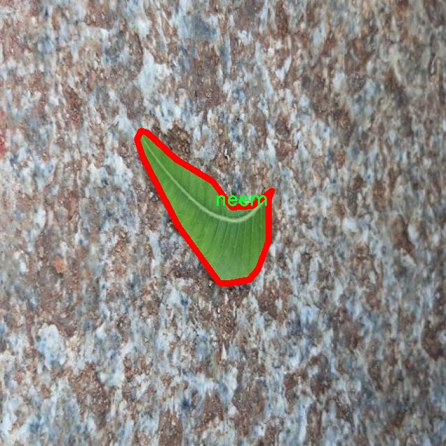

# 植物病害分割系统源码＆数据集分享
 [yolov8-seg-RevCol＆yolov8-seg-fasternet等50+全套改进创新点发刊_一键训练教程_Web前端展示]

### 1.研究背景与意义

项目参考[ILSVRC ImageNet Large Scale Visual Recognition Challenge](https://gitee.com/YOLOv8_YOLOv11_Segmentation_Studio/projects)

项目来源[AAAI Global Al lnnovation Contest](https://kdocs.cn/l/cszuIiCKVNis)

研究背景与意义

随着全球气候变化和农业生产方式的转变，植物病害的发生频率和种类日益增加，给农业生产带来了巨大的挑战。植物病害不仅影响作物的产量和质量，还可能导致经济损失和生态环境的恶化。因此，及时、准确地识别和分割植物病害，对于制定有效的防治措施、提高农业生产效率具有重要意义。近年来，计算机视觉和深度学习技术的快速发展为植物病害的自动检测和分割提供了新的解决方案。其中，YOLO（You Only Look Once）系列模型因其高效的实时检测能力而受到广泛关注。

本研究旨在基于改进的YOLOv8模型，构建一个高效的植物病害分割系统。YOLOv8作为YOLO系列的最新版本，结合了更先进的网络结构和训练策略，能够在保持高精度的同时，显著提高检测速度。通过对YOLOv8的改进，尤其是在处理复杂背景和多样化病害特征方面，可以更好地适应植物病害分割的需求。

本研究所使用的数据集包含6200张图像，涵盖128种植物病害类别。这些类别不仅包括常见的病害，如叶斑病、白粉病和细菌性枯萎病，还涉及多种特定植物的病害特征，如咖啡叶锈病、柑橘类细菌斑点等。这种丰富的类别设置为模型的训练和评估提供了良好的基础，使其能够在多样化的场景中进行有效的病害识别和分割。

在研究意义方面，首先，本研究将推动植物病害检测技术的发展，特别是在实例分割领域。通过对YOLOv8的改进和优化，期望能够提高模型在复杂环境下的表现，进而为农业生产提供更为可靠的技术支持。其次，研究成果将为农民和农业管理者提供有效的决策依据，帮助他们及时识别和处理植物病害，降低经济损失，提高作物产量和质量。此外，本研究还将为相关领域的研究者提供参考，促进植物病害检测技术的进一步探索和应用。

综上所述，基于改进YOLOv8的植物病害分割系统的研究，不仅具有重要的理论价值，还有助于解决实际农业生产中的问题，推动农业智能化的发展。通过这一研究，期望能够为实现可持续农业发展贡献一份力量。

### 2.图片演示







##### 注意：由于此博客编辑较早，上面“2.图片演示”和“3.视频演示”展示的系统图片或者视频可能为老版本，新版本在老版本的基础上升级如下：（实际效果以升级的新版本为准）

  （1）适配了YOLOV8的“目标检测”模型和“实例分割”模型，通过加载相应的权重（.pt）文件即可自适应加载模型。

  （2）支持“图片识别”、“视频识别”、“摄像头实时识别”三种识别模式。

  （3）支持“图片识别”、“视频识别”、“摄像头实时识别”三种识别结果保存导出，解决手动导出（容易卡顿出现爆内存）存在的问题，识别完自动保存结果并导出到tempDir中。

  （4）支持Web前端系统中的标题、背景图等自定义修改，后面提供修改教程。

  另外本项目提供训练的数据集和训练教程,暂不提供权重文件（best.pt）,需要您按照教程进行训练后实现图片演示和Web前端界面演示的效果。

### 3.视频演示

[3.1 视频演示](https://www.bilibili.com/video/BV1Zzx9eTEDF/)

### 4.数据集信息展示

##### 4.1 本项目数据集详细数据（类别数＆类别名）

nc: 128
names: ['.', 'Amruthaballi', 'Anthracnose', 'Astma_weed', 'Bamboo', 'CVC', 'Citrus bacterial spot', 'Citrus greasy spot', 'Hibiscus', 'Jackfruit', 'Jasmine', 'Kambajala', 'Kohlrabi', 'Lantana', 'Nelavembu', 'Parijatha', 'Phoma blight', 'alovera', 'alternaria blight', 'amla', 'anthracnosenooni', 'arali', 'ashoka', 'bacterial blast', 'bacterial wilt', 'badipala', 'balloon_Vine', 'beans', 'betel', 'bhrami', 'black root rot raddish', 'botryis blight', 'bringaraja', 'camphor', 'caricature', 'castor', 'catharanthus', 'chakte', 'chilly', 'citron canker', 'citron lime', 'citrus anthracnose', 'coffee', 'coffee leaf rust', 'coriender', 'coriender blight', 'curry', 'defected arali', 'defected betel', 'defected camphor', 'defectedAmruthaballi', 'defectedBamboo', 'defectedalovera', 'defectedamla', 'defectedashoka', 'defectedbadipala', 'defectedballoon_Vine', 'defectedbeans', 'defectedbhrami', 'defectedbringaraja', 'defectedcatharanthus', 'defectedseethaashoka', 'defectedspinach', 'defectedtamarind', 'defectedtaro', 'defectedtecoma', 'defectedthambe', 'defectedtomato', 'defectedtulsi', 'defectetedAstma_weed', 'dieback', 'disease in leaf', 'disease inamla', 'doddpathre', 'drumstick', 'ekka', 'eucalpytus', 'fasiation', 'ganigale', 'ganike', 'gasagase', 'ginger', 'globe amarnath', 'henna', 'honge', 'insulin', 'kamakasturi', 'kasamburga', 'late blightcaricature', 'leaf blotch', 'leaf curl', 'leaf rust', 'leaf spot', 'lemon', 'lemongrass', 'malabar_nut', 'mango', 'marigold', 'mint', 'neem', 'nerale', 'nooni', 'onion', 'padri', 'papaya', 'pea', 'pepper', 'pomgrana', 'pomgranate', 'powdery mildew', 'pumpkin', 'raddish', 'rose', 'sampige', 'sapota', 'seedling blight', 'seethaashoka', 'seethaphala', 'sooty mould', 'spinach', 'tamarind', 'taro', 'tecoma', 'thambe', 'tomato', 'tulsi', 'turmeric', 'wilt']


##### 4.2 本项目数据集信息介绍

数据集信息展示

在现代农业中，植物病害的早期识别与精准诊断至关重要，尤其是在全球气候变化和农业生产方式转型的背景下。为此，我们构建了一个名为“Pytocoin”的数据集，旨在为改进YOLOv8-seg的植物病害分割系统提供丰富的训练数据。该数据集涵盖了128个不同的植物病害类别，能够有效支持深度学习模型在植物病害检测和分割任务中的应用。

“Pytocoin”数据集的类别涵盖了多种植物及其相关病害，反映了广泛的植物种类和病害特征。这些类别包括但不限于“Amruthaballi”、“Anthracnose”、“Astma_weed”、“Bamboo”、“Citrus bacterial spot”等，具体涵盖了从常见的作物如“tomato”、“pepper”、“mango”到特殊植物如“henna”、“sapota”的多样性。每一类植物及其病害都经过精心标注，确保数据的准确性和有效性。

在数据集的构建过程中，我们特别关注了植物病害的多样性与复杂性。例如，类别“bacterial blast”和“bacterial wilt”分别代表了不同类型的细菌性病害，而“leaf curl”、“leaf spot”和“leaf rust”则展示了植物叶片上常见的病害表现。这种细致的分类不仅有助于模型的学习和识别能力提升，也为后续的病害管理提供了数据支持。

值得注意的是，数据集中还包含了许多植物的缺陷变种，如“defected amla”、“defected tomato”等，这些变种为模型提供了更为丰富的训练样本，增强了其在实际应用中的鲁棒性。此外，数据集中的“disease in leaf”、“dieback”等类别，进一步扩展了模型对植物病害表现形式的理解，确保其在不同场景下的适应能力。

“Pytocoin”数据集不仅是一个简单的图像集合，更是一个涵盖了植物病害识别所需的多维信息资源。通过将这些数据与YOLOv8-seg模型相结合，我们期望能够实现更高效的植物病害检测与分割，从而为农业生产提供科学依据和技术支持。该数据集的发布将为研究人员和开发者提供宝贵的资源，推动植物病害智能识别技术的发展。

总之，“Pytocoin”数据集以其丰富的类别和详尽的标注，为植物病害的深度学习研究提供了坚实的基础。我们相信，通过这一数据集的应用，能够有效提升植物病害检测的准确性与效率，为全球农业的可持续发展贡献力量。











### 5.全套项目环境部署视频教程（零基础手把手教学）

[5.1 环境部署教程链接（零基础手把手教学）](https://www.bilibili.com/video/BV1jG4Ve4E9t/?vd_source=bc9aec86d164b67a7004b996143742dc)


[5.2 安装Python虚拟环境创建和依赖库安装视频教程链接（零基础手把手教学）](https://www.bilibili.com/video/BV1nA4VeYEze/?vd_source=bc9aec86d164b67a7004b996143742dc)

### 6.手把手YOLOV8-seg训练视频教程（零基础小白有手就能学会）

[6.1 手把手YOLOV8-seg训练视频教程（零基础小白有手就能学会）](https://www.bilibili.com/video/BV1cA4VeYETe/?vd_source=bc9aec86d164b67a7004b996143742dc)


按照上面的训练视频教程链接加载项目提供的数据集，运行train.py即可开始训练



     Epoch   gpu_mem       box       obj       cls    labels  img_size
     1/200     0G   0.01576   0.01955  0.007536        22      1280: 100%|██████████| 849/849 [14:42<00:00,  1.04s/it]
               Class     Images     Labels          P          R     mAP@.5 mAP@.5:.95: 100%|██████████| 213/213 [01:14<00:00,  2.87it/s]
                 all       3395      17314      0.994      0.957      0.0957      0.0843

     Epoch   gpu_mem       box       obj       cls    labels  img_size
     2/200     0G   0.01578   0.01923  0.007006        22      1280: 100%|██████████| 849/849 [14:44<00:00,  1.04s/it]
               Class     Images     Labels          P          R     mAP@.5 mAP@.5:.95: 100%|██████████| 213/213 [01:12<00:00,  2.95it/s]
                 all       3395      17314      0.996      0.956      0.0957      0.0845

     Epoch   gpu_mem       box       obj       cls    labels  img_size
     3/200     0G   0.01561    0.0191  0.006895        27      1280: 100%|██████████| 849/849 [10:56<00:00,  1.29it/s]
               Class     Images     Labels          P          R     mAP@.5 mAP@.5:.95: 100%|███████   | 187/213 [00:52<00:00,  4.04it/s]
                 all       3395      17314      0.996      0.957      0.0957      0.0845


### 7.50+种全套YOLOV8-seg创新点代码加载调参视频教程（一键加载写好的改进模型的配置文件）

[7.1 50+种全套YOLOV8-seg创新点代码加载调参视频教程（一键加载写好的改进模型的配置文件）](https://www.bilibili.com/video/BV1Hw4VePEXv/?vd_source=bc9aec86d164b67a7004b996143742dc)

### 8.YOLOV8-seg图像分割算法原理

原始YOLOv8-seg算法原理

YOLOv8-seg算法是YOLO系列目标检测算法的最新进展，基于YOLOv5和YOLOv7的成功经验，整合了多项创新和改进，形成了一种高效且精确的目标检测和分割方法。该算法的核心架构依然保持了YOLO系列一贯的设计理念，包括输入层、主干网络、特征融合层和解耦头部分。尽管YOLOv8的论文尚未正式发表，但其在实际应用中的表现已引起了广泛关注。

在YOLOv8的主干网络中，采用了CSPDarknet的思想，这一设计延续了YOLOv5的架构，但对C3模块进行了优化，替换为C2f模块。C2f模块引入了ELAN的设计理念，通过增加跳层连接来改善梯度流动，从而有效缓解深层网络中的梯度消失问题。C2f模块由多个CBS（卷积+归一化+SiLU激活）模块和Bottleneck结构组成，能够在特征提取过程中实现更丰富的特征表示，保持输入和输出通道的一致性，确保特征的有效传递。

YOLOv8的特征融合层采用了PAN-FPN结构，旨在实现多尺度特征的深度融合。该结构通过自下而上的方式将高层特征与中层和浅层特征进行结合，确保不同层次的特征信息能够有效互补。YOLOv8在这一阶段的设计中，删除了YOLOv5中上采样阶段的1x1卷积，直接将高层特征进行上采样后与中层特征进行连接，进一步提升了特征融合的效率和准确性。

与以往版本不同，YOLOv8采用了Anchor-Free的设计理念，摒弃了传统的Anchor-Base方法。这一转变使得模型在目标检测时能够更加灵活地处理不同形状和大小的目标，降低了对预设锚框的依赖。为了适应这一变化，YOLOv8引入了Task-Aligned的样本匹配策略，优化了正负样本的分配，使得模型在训练过程中能够更好地学习到目标的特征。

在损失函数的设计上，YOLOv8采用了VFLLoss作为分类损失，DFLLoss和CIoULoss作为回归损失。这一组合不仅提高了分类的准确性，还增强了边界框回归的效果，确保模型在定位和分类任务中均能表现出色。尤其是在处理小目标时，Focal Loss的引入有效解决了样本不平衡的问题，使得模型在面对复杂场景时仍能保持高效的检测能力。

YOLOv8的头部结构借鉴了YOLOX和YOLOv6的解耦头设计，取消了objectness分支，采用了更加简化的结构。通过对特征图的解耦处理，YOLOv8能够独立地进行目标分类和边框回归，从而提升了模型的收敛速度和检测精度。解耦头的设计使得模型在处理不同任务时能够更好地聚焦于特定的特征，从而提高了整体性能。

在数据预处理方面，YOLOv8延续了YOLOv5的策略，采用了多种数据增强手段，如马赛克增强、混合增强、空间扰动和颜色扰动等，以提升模型的鲁棒性和泛化能力。然而，在训练的最后阶段，YOLOv8停止使用马赛克增强，以避免对数据真实分布的破坏，从而确保模型能够学习到更有效的特征。

总体而言，YOLOv8-seg算法在多个方面进行了创新和优化，结合了深度学习领域的最新研究成果，形成了一种高效、准确且易于部署的目标检测和分割解决方案。通过对主干网络、特征融合层和解耦头的精心设计，YOLOv8不仅提升了目标检测的速度和精度，还在处理复杂场景和小目标时展现出了优越的性能。这使得YOLOv8成为当前目标检测领域中的一项重要进展，具有广泛的应用前景和研究价值。


### 9.系统功能展示（检测对象为举例，实际内容以本项目数据集为准）

图9.1.系统支持检测结果表格显示

  图9.2.系统支持置信度和IOU阈值手动调节

  图9.3.系统支持自定义加载权重文件best.pt(需要你通过步骤5中训练获得)

  图9.4.系统支持摄像头实时识别

  图9.5.系统支持图片识别

  图9.6.系统支持视频识别

  图9.7.系统支持识别结果文件自动保存

  图9.8.系统支持Excel导出检测结果数据


### 10.50+种全套YOLOV8-seg创新点原理讲解（非科班也可以轻松写刊发刊，V11版本正在科研待更新）

#### 10.1 由于篇幅限制，每个创新点的具体原理讲解就不一一展开，具体见下列网址中的创新点对应子项目的技术原理博客网址【Blog】：


[10.1 50+种全套YOLOV8-seg创新点原理讲解链接](https://gitee.com/qunmasj/good)

#### 10.2 部分改进模块原理讲解(完整的改进原理见上图和技术博客链接)

### Gold-YOLO


#### Preliminaries
YOLO系列的中间层结构采用了传统的FPN结构，其中包含多个分支用于多尺度特征融合。然而，它只充分融合来自相邻级别的特征，对于其他层次的信息只能间接地进行“递归”获取。

传统的FPN结构在信息传输过程中存在丢失大量信息的问题。这是因为层之间的信息交互仅限于中间层选择的信息，未被选择的信息在传输过程中被丢弃。这种情况导致某个Level的信息只能充分辅助相邻层，而对其他全局层的帮助较弱。因此，整体上信息融合的有效性可能受到限制。
为了避免在传输过程中丢失信息，本文采用了一种新颖的“聚集和分发”机制（GD），放弃了原始的递归方法。该机制使用一个统一的模块来收集和融合所有Level的信息，并将其分发到不同的Level。通过这种方式，作者不仅避免了传统FPN结构固有的信息丢失问题，还增强了中间层的部分信息融合能力，而且并没有显著增加延迟。


#### 低阶聚合和分发分支 Low-stage gather-and-distribute branch
从主干网络中选择输出的B2、B3、B4、B5特征进行融合，以获取保留小目标信息的高分辨率特征。


#### 高阶聚合和分发分支 High-stage gather-and-distribute branch
高级全局特征对齐模块（High-GD）将由低级全局特征对齐模块（Low-GD）生成的特征{P3, P4, P5}进行融合。


Transformer融合模块由多个堆叠的transformer组成，transformer块的数量为L。每个transformer块包括一个多头注意力块、一个前馈网络（FFN）和残差连接。采用与LeViT相同的设置来配置多头注意力块，使用16个通道作为键K和查询Q的头维度，32个通道作为值V的头维度。为了加速推理过程，将层归一化操作替换为批归一化，并将所有的GELU激活函数替换为ReLU。为了增强变换器块的局部连接，在两个1x1卷积层之间添加了一个深度卷积层。同时，将FFN的扩展因子设置为2，以在速度和计算成本之间取得平衡。


信息注入模块(Information injection module)： 高级全局特征对齐模块（High-GD）中的信息注入模块与低级全局特征对齐模块（Low-GD）中的相同。在高级阶段，局部特征（Flocal）等于Pi，因此公式如下所示：


#### 增强的跨层信息流动 Enhanced cross-layer information flow
为了进一步提升性能，从YOLOv6 中的PAFPN模块中得到启发，引入了Inject-LAF模块。该模块是注入模块的增强版，包括了一个轻量级相邻层融合（LAF）模块，该模块被添加到注入模块的输入位置。为了在速度和准确性之间取得平衡，设计了两个LAF模型：LAF低级模型和LAF高级模型，分别用于低级注入（合并相邻两层的特征）和高级注入（合并相邻一层的特征）。它们的结构如图5(b)所示。为了确保来自不同层级的特征图与目标大小对齐，在实现中的两个LAF模型仅使用了三个操作符：双线性插值（上采样过小的特征）、平均池化（下采样过大的特征）和1x1卷积（调整与目标通道不同的特征）。模型中的LAF模块与信息注入模块的结合有效地平衡了准确性和速度之间的关系。通过使用简化的操作，能够增加不同层级之间的信息流路径数量，从而提高性能而不显著增加延迟。


### 11.项目核心源码讲解（再也不用担心看不懂代码逻辑）

#### 11.1 ui.py

以下是经过精简和注释的核心代码部分：

```python
import sys
import subprocess
from QtFusion.path import abs_path

def run_script(script_path):
    """
    使用当前 Python 环境运行指定的脚本。

    Args:
        script_path (str): 要运行的脚本路径
    """
    # 获取当前 Python 解释器的路径
    python_path = sys.executable

    # 构建运行命令，使用 streamlit 运行指定的脚本
    command = f'"{python_path}" -m streamlit run "{script_path}"'

    # 执行命令并等待其完成
    result = subprocess.run(command, shell=True)
    
    # 检查命令执行结果，如果返回码不为0，则表示出错
    if result.returncode != 0:
        print("脚本运行出错。")

# 主程序入口
if __name__ == "__main__":
    # 获取要运行的脚本的绝对路径
    script_path = abs_path("web.py")

    # 调用函数运行脚本
    run_script(script_path)
```

### 代码分析和注释：

1. **导入模块**：
   - `sys`：用于访问与 Python 解释器相关的变量和函数。
   - `subprocess`：用于创建新进程、连接到它们的输入/输出/错误管道，并获取它们的返回码。
   - `abs_path`：从 `QtFusion.path` 模块导入的函数，用于获取文件的绝对路径。

2. **`run_script` 函数**：
   - 该函数接收一个脚本路径作为参数，并使用当前 Python 环境运行该脚本。
   - `python_path = sys.executable`：获取当前 Python 解释器的路径，以确保使用正确的 Python 环境。
   - `command`：构建要执行的命令字符串，使用 `streamlit` 模块运行指定的脚本。
   - `subprocess.run`：执行构建的命令，并等待其完成。
   - `result.returncode`：检查命令的返回码，若不为0则表示执行过程中出现错误。

3. **主程序入口**：
   - `if __name__ == "__main__":`：确保只有在直接运行该脚本时才会执行以下代码。
   - `script_path = abs_path("web.py")`：获取要运行的脚本的绝对路径。
   - `run_script(script_path)`：调用 `run_script` 函数来执行指定的脚本。

这个程序文件 `ui.py` 的主要功能是运行一个指定的 Python 脚本，具体来说是使用 Streamlit 框架来启动一个 Web 应用。程序首先导入了必要的模块，包括 `sys`、`os` 和 `subprocess`，以及一个自定义的路径处理函数 `abs_path`。

在 `run_script` 函数中，程序接收一个脚本路径作为参数。首先，它通过 `sys.executable` 获取当前 Python 解释器的路径，以确保使用正确的 Python 环境来运行脚本。接着，程序构建了一个命令字符串，该命令使用 `streamlit run` 来启动指定的脚本。这个命令会在命令行中执行。

使用 `subprocess.run` 方法，程序将构建的命令作为参数传入，并通过 `shell=True` 选项在一个新的 shell 中执行这个命令。执行完毕后，程序检查返回码，如果返回码不为零，说明脚本运行时出现了错误，此时会打印出一条错误信息。

在文件的最后部分，程序通过 `if __name__ == "__main__":` 判断是否是直接运行该脚本。如果是，它会调用 `abs_path` 函数来获取 `web.py` 脚本的绝对路径，并将其传递给 `run_script` 函数，从而启动 Web 应用。

总的来说，这个文件的功能是为一个 Streamlit 应用提供一个启动入口，确保在正确的 Python 环境中运行指定的脚本，并处理可能出现的错误。

#### 11.2 ultralytics\hub\__init__.py

以下是代码中最核心的部分，并附上详细的中文注释：

```python
import requests  # 导入requests库，用于发送HTTP请求

from ultralytics.hub.auth import Auth  # 导入身份验证模块
from ultralytics.utils import LOGGER, SETTINGS  # 导入日志记录和设置模块

def login(api_key=''):
    """
    使用提供的API密钥登录Ultralytics HUB API。

    参数:
        api_key (str, optional): 可能是API密钥或API密钥与模型ID的组合，即key_id

    示例:
        ```python
        from ultralytics import hub

        hub.login('API_KEY')
        ```
    """
    Auth(api_key, verbose=True)  # 调用Auth类进行身份验证，verbose=True表示输出详细信息


def logout():
    """
    通过从设置文件中移除API密钥来登出Ultralytics HUB。
    要再次登录，请使用'yolo hub login'。

    示例:
        ```python
        from ultralytics import hub

        hub.logout()
        ```
    """
    SETTINGS['api_key'] = ''  # 清空API密钥
    SETTINGS.save()  # 保存设置
    LOGGER.info(f"logged out ✅. To log in again, use 'yolo hub login'.")  # 记录登出信息


def reset_model(model_id=''):
    """将训练好的模型重置为未训练状态。"""
    r = requests.post(f'{HUB_API_ROOT}/model-reset', json={'apiKey': Auth().api_key, 'modelId': model_id})  # 发送POST请求重置模型
    if r.status_code == 200:  # 检查请求是否成功
        LOGGER.info('Model reset successfully')  # 记录成功信息
        return
    LOGGER.warning(f'Model reset failure {r.status_code} {r.reason}')  # 记录失败信息


def export_model(model_id='', format='torchscript'):
    """将模型导出为所有支持的格式。"""
    r = requests.post(f'{HUB_API_ROOT}/v1/models/{model_id}/export',
                      json={'format': format},
                      headers={'x-api-key': Auth().api_key})  # 发送POST请求导出模型
    assert r.status_code == 200, f'export failure {r.status_code} {r.reason}'  # 检查请求是否成功
    LOGGER.info(f'{format} export started ✅')  # 记录导出开始的信息


def check_dataset(path='', task='detect'):
    """
    在上传之前检查HUB数据集Zip文件的错误。
    它在上传到HUB之前检查数据集是否存在错误。

    参数:
        path (str, optional): 数据集zip文件的路径（其中包含data.yaml）。默认为''。
        task (str, optional): 数据集任务。选项有'detect'、'segment'、'pose'、'classify'。默认为'detect'。

    示例:
        ```python
        from ultralytics.hub import check_dataset

        check_dataset('path/to/coco8.zip', task='detect')  # 检查检测数据集
        ```
    """
    HUBDatasetStats(path=path, task=task).get_json()  # 使用HUBDatasetStats检查数据集
    LOGGER.info('Checks completed correctly ✅. Upload this dataset to HUB.')  # 记录检查完成的信息
```

### 代码核心部分说明：
1. **登录和登出功能**：`login`和`logout`函数用于用户身份验证，确保用户可以安全地访问HUB。
2. **模型重置**：`reset_model`函数允许用户将训练好的模型重置为未训练状态，方便重新训练。
3. **模型导出**：`export_model`函数用于将模型导出为指定格式，便于在不同环境中使用。
4. **数据集检查**：`check_dataset`函数用于在上传数据集之前检查其有效性，确保数据集符合要求。

这个程序文件是Ultralytics YOLO的一个模块，主要用于与Ultralytics HUB进行交互，提供了一些API操作的功能。文件中包含了一些重要的函数，下面是对这些函数的逐一说明。

首先，`login`函数用于通过提供的API密钥登录Ultralytics HUB API。用户可以通过传入API密钥来进行身份验证，成功后可以访问HUB的功能。函数内部调用了`Auth`类来处理身份验证，并提供了一个示例代码，说明如何使用该函数。

接下来，`logout`函数用于登出Ultralytics HUB。它通过将设置文件中的API密钥清空来实现登出功能。登出后，用户可以使用`yolo hub login`命令重新登录。该函数还记录了一条日志，确认用户已成功登出。

`reset_model`函数用于将已训练的模型重置为未训练状态。它通过向HUB API发送POST请求来实现重置功能，并根据响应状态码记录成功或失败的信息。

`export_fmts_hub`函数返回HUB支持的导出格式列表。它从`ultralytics.engine.exporter`模块中获取可用的导出格式，并添加了一些特定的格式，如`ultralytics_tflite`和`ultralytics_coreml`。

`export_model`函数用于将模型导出为指定格式。用户需要提供模型ID和导出格式，函数会检查格式是否受支持，然后向HUB API发送请求进行导出。如果导出请求成功，函数会记录一条成功的日志。

`get_export`函数用于获取已导出的模型的字典信息，包括下载链接。它同样需要模型ID和导出格式作为参数，并在请求成功后返回响应的JSON数据。

最后，`check_dataset`函数用于在上传数据集到HUB之前进行错误检查。它检查一个ZIP格式的数据集文件，确保其中包含有效的数据和配置。用户可以指定数据集的路径和任务类型（如检测、分割、姿态估计等），函数会执行检查并记录结果。

总体而言，这个模块提供了一系列与Ultralytics HUB交互的功能，方便用户进行模型管理、数据集检查和导出操作。

#### 11.3 ultralytics\hub\auth.py

以下是代码中最核心的部分，并附上详细的中文注释：

```python
import requests

class Auth:
    """
    处理身份验证过程，包括API密钥处理、基于cookie的身份验证和头部生成。

    支持不同的身份验证方法：
    1. 直接使用API密钥。
    2. 使用浏览器cookie进行身份验证（特别是在Google Colab中）。
    3. 提示用户输入API密钥。
    """
    id_token = api_key = model_key = False  # 初始化身份验证相关的属性

    def __init__(self, api_key='', verbose=False):
        """
        初始化Auth类，接受一个可选的API密钥。

        参数：
            api_key (str, optional): 可能是API密钥或组合的API密钥和模型ID。
        """
        # 分割输入的API密钥，以防它包含组合的key_model，只保留API密钥部分
        api_key = api_key.split('_')[0]

        # 设置API密钥属性，如果没有提供则使用设置中的API密钥
        self.api_key = api_key or SETTINGS.get('api_key', '')

        # 如果提供了API密钥
        if self.api_key:
            # 检查提供的API密钥是否与设置中的API密钥匹配
            if self.api_key == SETTINGS.get('api_key'):
                # 记录用户已经登录
                if verbose:
                    LOGGER.info(f'已认证 ✅')
                return
            else:
                # 尝试使用提供的API密钥进行身份验证
                success = self.authenticate()
        # 如果没有提供API密钥且环境是Google Colab
        elif is_colab():
            # 尝试使用浏览器cookie进行身份验证
            success = self.auth_with_cookies()
        else:
            # 请求用户输入API密钥
            success = self.request_api_key()

        # 在成功身份验证后更新设置中的API密钥
        if success:
            SETTINGS.update({'api_key': self.api_key})
            if verbose:
                LOGGER.info(f'新认证成功 ✅')
        elif verbose:
            LOGGER.info(f'从 {API_KEY_URL} 获取API密钥')

    def authenticate(self) -> bool:
        """
        尝试使用id_token或API密钥进行服务器身份验证。

        返回：
            bool: 如果身份验证成功则返回True，否则返回False。
        """
        try:
            header = self.get_auth_header()  # 获取身份验证头部
            if header:
                r = requests.post(f'{HUB_API_ROOT}/v1/auth', headers=header)  # 发送身份验证请求
                if not r.json().get('success', False):
                    raise ConnectionError('无法进行身份验证。')
                return True
            raise ConnectionError('用户尚未本地认证。')
        except ConnectionError:
            self.id_token = self.api_key = False  # 重置无效的身份验证信息
            LOGGER.warning('无效的API密钥 ⚠️')
            return False

    def get_auth_header(self):
        """
        获取用于API请求的身份验证头部。

        返回：
            (dict): 如果设置了id_token或API密钥，则返回身份验证头部，否则返回None。
        """
        if self.id_token:
            return {'authorization': f'Bearer {self.id_token}'}
        elif self.api_key:
            return {'x-api-key': self.api_key}
        return None  # 如果没有有效的身份验证信息，返回None
```

### 代码核心部分说明：
1. **Auth类**：负责处理身份验证的逻辑，包括API密钥和cookie的使用。
2. **初始化方法**：接受一个可选的API密钥，并根据提供的密钥或环境（如Google Colab）进行身份验证。
3. **authenticate方法**：通过发送请求到服务器来验证API密钥或id_token的有效性。
4. **get_auth_header方法**：生成用于API请求的身份验证头部，确保请求中包含必要的身份验证信息。

这个程序文件 `auth.py` 是用于管理 Ultralytics YOLO 的身份验证过程，主要涉及 API 密钥的处理、基于 Cookie 的身份验证以及请求头的生成。该类 `Auth` 提供了多种身份验证方法，包括直接使用 API 密钥、使用浏览器 Cookie 进行身份验证（特别是在 Google Colab 中），以及提示用户输入 API 密钥。

在类的属性中，`id_token`、`api_key` 和 `model_key` 都被初始化为 `False`，其中 `id_token` 用于身份验证，`api_key` 用于 API 访问，而 `model_key` 是一个占位符。构造函数 `__init__` 接受一个可选的 API 密钥参数，并根据提供的密钥或设置中的密钥进行初始化。如果提供的 API 密钥与设置中的密钥匹配，程序会记录用户已登录的信息；如果不匹配，则尝试进行身份验证。如果没有提供 API 密钥且当前环境是 Google Colab，程序会尝试使用浏览器 Cookie 进行身份验证；否则，它会请求用户输入 API 密钥。

`request_api_key` 方法用于提示用户输入 API 密钥，最多尝试三次。如果成功，程序会更新设置并记录新的登录信息；如果失败，则抛出连接错误。`authenticate` 方法尝试使用 `id_token` 或 API 密钥与服务器进行身份验证，返回布尔值表示认证是否成功。如果认证失败，会重置 `id_token` 和 `api_key` 并记录警告信息。

`auth_with_cookies` 方法专门用于在 Google Colab 中通过 Cookie 进行身份验证。它会尝试获取浏览器的身份验证信息并设置 `id_token`，如果成功则进行后续的身份验证。最后，`get_auth_header` 方法用于生成 API 请求的身份验证头，如果 `id_token` 或 `api_key` 被设置，则返回相应的请求头，否则返回 `None`。

整体而言，这个文件的主要功能是确保用户能够安全地进行身份验证，以便访问 Ultralytics 的服务和资源。

#### 11.4 train.py

以下是代码中最核心的部分，并附上详细的中文注释：

```python
import os
import torch
import yaml
from ultralytics import YOLO  # 导入YOLO模型库

if __name__ == '__main__':  # 确保该模块被直接运行时才执行以下代码
    # 设置训练参数
    workers = 1  # 数据加载的工作进程数
    batch = 8  # 每个批次的样本数量，视显存和内存情况调整
    device = "0" if torch.cuda.is_available() else "cpu"  # 判断是否使用GPU

    # 获取数据集配置文件的绝对路径
    data_path = abs_path(f'datasets/data/data.yaml', path_type='current')

    # 将路径格式转换为Unix风格
    unix_style_path = data_path.replace(os.sep, '/')
    # 获取目录路径
    directory_path = os.path.dirname(unix_style_path)

    # 读取YAML配置文件
    with open(data_path, 'r') as file:
        data = yaml.load(file, Loader=yaml.FullLoader)

    # 修改YAML文件中的路径项
    if 'train' in data and 'val' in data and 'test' in data:
        data['train'] = directory_path + '/train'  # 更新训练集路径
        data['val'] = directory_path + '/val'      # 更新验证集路径
        data['test'] = directory_path + '/test'    # 更新测试集路径

        # 将修改后的数据写回YAML文件
        with open(data_path, 'w') as file:
            yaml.safe_dump(data, file, sort_keys=False)

    # 加载YOLO模型配置文件和预训练权重
    model = YOLO(r"C:\codeseg\codenew\50+种YOLOv8算法改进源码大全和调试加载训练教程（非必要）\改进YOLOv8模型配置文件\yolov8-seg-C2f-Faster.yaml").load("./weights/yolov8s-seg.pt")

    # 开始训练模型
    results = model.train(
        data=data_path,  # 指定训练数据的配置文件路径
        device=device,  # 使用指定的设备进行训练
        workers=workers,  # 指定使用的工作进程数
        imgsz=640,  # 输入图像的大小为640x640
        epochs=100,  # 训练100个epoch
        batch=batch,  # 每个批次的大小为8
    )
```

### 代码核心部分说明：
1. **参数设置**：设置了训练的基本参数，包括工作进程数、批次大小和设备选择（GPU或CPU）。
2. **数据路径处理**：读取YAML配置文件，修改其中的训练、验证和测试数据路径，确保路径正确。
3. **模型加载**：加载YOLO模型的配置文件和预训练权重，为后续的训练做准备。
4. **模型训练**：调用模型的训练方法，传入数据路径、设备、工作进程数、图像大小和训练轮数等参数，开始训练过程。

该程序文件`train.py`的主要功能是使用YOLO（You Only Look Once）模型进行目标检测的训练。程序首先导入了必要的库，包括操作系统相关的`os`、深度学习框架`torch`、YAML文件处理库`yaml`、YOLO模型的实现以及路径处理工具`abs_path`。此外，还导入了`matplotlib`用于图形显示。

在程序的主入口部分，首先设置了一些训练参数，包括工作进程数`workers`、批次大小`batch`、以及设备选择`device`。设备选择会根据是否有可用的GPU来决定使用CUDA还是CPU。接着，程序通过`abs_path`函数获取数据集配置文件的绝对路径，该配置文件为YAML格式，包含了训练、验证和测试数据的路径。

程序将获取到的路径转换为Unix风格的路径，并提取出目录路径。然后，它打开YAML文件并读取内容，确保保持原有的顺序。接下来，程序检查YAML文件中是否包含`train`、`val`和`test`字段，如果存在，则将这些字段的值修改为相应的目录路径，并将修改后的内容写回到YAML文件中。

在模型加载部分，程序使用YOLO模型的配置文件加载预训练的YOLOv8模型。需要注意的是，不同的YOLO模型对设备的要求不同，程序中也给出了可以替换的模型配置文件供用户选择。

最后，程序调用`model.train`方法开始训练模型，传入了训练数据的配置文件路径、设备、工作进程数、输入图像大小、训练的轮数（epoch）以及批次大小等参数。通过这些设置，程序将开始对YOLO模型进行训练，利用指定的数据集进行目标检测任务。

#### 11.5 ultralytics\models\yolo\classify\train.py

以下是经过简化和注释的核心代码部分：

```python
import torch
from ultralytics.data import ClassificationDataset, build_dataloader
from ultralytics.engine.trainer import BaseTrainer
from ultralytics.models import yolo
from ultralytics.nn.tasks import ClassificationModel
from ultralytics.utils import DEFAULT_CFG, LOGGER, RANK, colorstr

class ClassificationTrainer(BaseTrainer):
    """
    继承自 BaseTrainer 类，用于基于分类模型的训练。
    """

    def __init__(self, cfg=DEFAULT_CFG, overrides=None, _callbacks=None):
        """初始化 ClassificationTrainer 对象，支持配置覆盖和回调函数。"""
        if overrides is None:
            overrides = {}
        overrides['task'] = 'classify'  # 设置任务类型为分类
        if overrides.get('imgsz') is None:
            overrides['imgsz'] = 224  # 默认图像大小为224
        super().__init__(cfg, overrides, _callbacks)

    def set_model_attributes(self):
        """从加载的数据集中设置 YOLO 模型的类名。"""
        self.model.names = self.data['names']

    def get_model(self, cfg=None, weights=None, verbose=True):
        """返回配置好的 PyTorch 模型以进行 YOLO 训练。"""
        model = ClassificationModel(cfg, nc=self.data['nc'], verbose=verbose and RANK == -1)
        if weights:
            model.load(weights)  # 加载权重

        for m in model.modules():
            if not self.args.pretrained and hasattr(m, 'reset_parameters'):
                m.reset_parameters()  # 重置参数
            if isinstance(m, torch.nn.Dropout) and self.args.dropout:
                m.p = self.args.dropout  # 设置 dropout
        for p in model.parameters():
            p.requires_grad = True  # 训练时需要梯度
        return model

    def build_dataset(self, img_path, mode='train'):
        """根据图像路径和模式（训练/测试等）创建 ClassificationDataset 实例。"""
        return ClassificationDataset(root=img_path, args=self.args, augment=mode == 'train', prefix=mode)

    def get_dataloader(self, dataset_path, batch_size=16, rank=0, mode='train'):
        """返回带有图像预处理的 PyTorch DataLoader。"""
        dataset = self.build_dataset(dataset_path, mode)  # 构建数据集
        loader = build_dataloader(dataset, batch_size, self.args.workers, rank=rank)  # 构建数据加载器
        return loader

    def preprocess_batch(self, batch):
        """预处理一批图像和类标签。"""
        batch['img'] = batch['img'].to(self.device)  # 将图像移动到设备
        batch['cls'] = batch['cls'].to(self.device)  # 将类标签移动到设备
        return batch

    def get_validator(self):
        """返回用于验证的 ClassificationValidator 实例。"""
        self.loss_names = ['loss']  # 定义损失名称
        return yolo.classify.ClassificationValidator(self.test_loader, self.save_dir)

    def final_eval(self):
        """评估训练后的模型并保存验证结果。"""
        for f in self.last, self.best:
            if f.exists():
                if f is self.best:
                    LOGGER.info(f'\nValidating {f}...')
                    self.metrics = self.validator(model=f)  # 验证模型
                    self.metrics.pop('fitness', None)  # 移除 fitness
        LOGGER.info(f"Results saved to {colorstr('bold', self.save_dir)}")  # 保存结果信息
```

### 代码说明：
1. **导入必要的库**：导入 PyTorch 和 Ultralytics 相关模块。
2. **ClassificationTrainer 类**：该类用于处理分类任务的训练，继承自 `BaseTrainer`。
3. **初始化方法**：设置任务类型为分类，并指定默认图像大小。
4. **设置模型属性**：从数据集中获取类名并设置到模型中。
5. **获取模型**：根据配置和权重加载分类模型，并设置模型参数。
6. **构建数据集**：根据给定路径和模式创建数据集实例。
7. **获取数据加载器**：构建并返回数据加载器，用于批量加载数据。
8. **预处理批次**：将图像和类标签移动到指定设备（如 GPU）。
9. **获取验证器**：返回用于模型验证的实例。
10. **最终评估**：评估训练后的模型并保存结果。

这个程序文件是用于训练分类模型的，主要是基于Ultralytics YOLO框架。它通过继承自`BaseTrainer`类，定义了一个`ClassificationTrainer`类，专门用于处理图像分类任务。

在初始化方法中，`ClassificationTrainer`接收一些配置参数，包括模型配置、覆盖的参数和回调函数。如果没有提供覆盖参数，则默认使用空字典。此处还设置了任务类型为“classify”，并且如果没有指定图像大小，则默认设置为224。

`set_model_attributes`方法用于从加载的数据集中设置YOLO模型的类名。`get_model`方法则返回一个配置好的PyTorch模型，用于训练YOLO。它会加载预训练权重，并根据需要重置模型参数，确保在训练时所有参数都可更新。

`setup_model`方法负责加载或创建模型。如果模型是以`.pt`结尾的文件名，它会尝试从本地加载权重；如果是以`.yaml`或`.yml`结尾，则会根据配置文件创建模型；如果是来自`torchvision`的模型名，则会直接调用相应的模型。加载完成后，还会对模型的输出进行调整，以适应数据集的类别数。

`build_dataset`方法创建一个`ClassificationDataset`实例，指定图像路径和模式（如训练或测试）。`get_dataloader`方法则返回一个PyTorch的`DataLoader`，用于在推理时对图像进行预处理，并支持分布式训练。

在`preprocess_batch`方法中，对图像和类别进行设备转移，以便在GPU上进行训练。`progress_string`方法返回一个格式化的字符串，用于显示训练进度。

`get_validator`方法返回一个用于验证的`ClassificationValidator`实例，`label_loss_items`方法则返回一个带有标签的损失字典，尽管对于分类任务，这个方法并不是必需的。

`plot_metrics`方法用于从CSV文件中绘制指标，`final_eval`方法则对训练好的模型进行评估并保存验证结果。最后，`plot_training_samples`方法用于绘制带有注释的训练样本图像。

总体而言，这个文件提供了一个完整的框架，用于训练图像分类模型，涵盖了模型的加载、数据集的构建、训练过程的管理以及结果的评估和可视化。

#### 11.6 ultralytics\nn\extra_modules\afpn.py

以下是经过简化并添加详细中文注释的核心代码部分：

```python
import torch
import torch.nn as nn
import torch.nn.functional as F
from ..modules.conv import Conv

# 定义基本的卷积块
class BasicBlock(nn.Module):
    def __init__(self, filter_in, filter_out):
        super(BasicBlock, self).__init__()
        # 定义两个卷积层
        self.conv1 = Conv(filter_in, filter_out, 3)  # 第一个卷积层
        self.conv2 = Conv(filter_out, filter_out, 3, act=False)  # 第二个卷积层，不使用激活函数

    def forward(self, x):
        residual = x  # 保存输入以便后续加回去
        out = self.conv1(x)  # 通过第一个卷积层
        out = self.conv2(out)  # 通过第二个卷积层
        out += residual  # 残差连接
        return self.conv1.act(out)  # 返回经过激活函数处理的输出


# 定义上采样模块
class Upsample(nn.Module):
    def __init__(self, in_channels, out_channels, scale_factor=2):
        super(Upsample, self).__init__()
        # 定义上采样的卷积层和上采样操作
        self.upsample = nn.Sequential(
            Conv(in_channels, out_channels, 1),  # 1x1卷积
            nn.Upsample(scale_factor=scale_factor, mode='bilinear')  # 双线性插值上采样
        )

    def forward(self, x):
        return self.upsample(x)  # 直接返回上采样结果


# 定义下采样模块
class Downsample_x2(nn.Module):
    def __init__(self, in_channels, out_channels):
        super(Downsample_x2, self).__init__()
        # 定义2倍下采样的卷积层
        self.downsample = Conv(in_channels, out_channels, 2, 2, 0)

    def forward(self, x):
        return self.downsample(x)  # 直接返回下采样结果


# 定义自适应特征融合模块（ASFF）
class ASFF_2(nn.Module):
    def __init__(self, inter_dim=512):
        super(ASFF_2, self).__init__()
        self.inter_dim = inter_dim
        compress_c = 8  # 压缩通道数

        # 定义用于计算权重的卷积层
        self.weight_level_1 = Conv(self.inter_dim, compress_c, 1)
        self.weight_level_2 = Conv(self.inter_dim, compress_c, 1)
        self.weight_levels = nn.Conv2d(compress_c * 2, 2, kernel_size=1)  # 权重层
        self.conv = Conv(self.inter_dim, self.inter_dim, 3)  # 融合后的卷积层

    def forward(self, input1, input2):
        # 计算每个输入的权重
        level_1_weight_v = self.weight_level_1(input1)
        level_2_weight_v = self.weight_level_2(input2)

        # 将权重拼接并计算最终权重
        levels_weight_v = torch.cat((level_1_weight_v, level_2_weight_v), 1)
        levels_weight = self.weight_levels(levels_weight_v)
        levels_weight = F.softmax(levels_weight, dim=1)  # 归一化权重

        # 融合输入特征
        fused_out_reduced = input1 * levels_weight[:, 0:1, :, :] + \
                            input2 * levels_weight[:, 1:2, :, :]

        return self.conv(fused_out_reduced)  # 返回融合后的特征


# 定义特征金字塔网络（AFPN）
class AFPN_P345(nn.Module):
    def __init__(self, in_channels=[256, 512, 1024], out_channels=256, factor=4):
        super(AFPN_P345, self).__init__()

        # 定义输入通道到输出通道的卷积层
        self.conv0 = Conv(in_channels[0], in_channels[0] // factor, 1)
        self.conv1 = Conv(in_channels[1], in_channels[1] // factor, 1)
        self.conv2 = Conv(in_channels[2], in_channels[2] // factor, 1)

        # 定义特征块
        self.body = BlockBody_P345([in_channels[0] // factor, in_channels[1] // factor, in_channels[2] // factor])

        # 定义输出卷积层
        self.conv00 = Conv(in_channels[0] // factor, out_channels, 1)
        self.conv11 = Conv(in_channels[1] // factor, out_channels, 1)
        self.conv22 = Conv(in_channels[2] // factor, out_channels, 1)

    def forward(self, x):
        x0, x1, x2 = x  # 拆分输入特征
        x0 = self.conv0(x0)  # 处理第一个输入
        x1 = self.conv1(x1)  # 处理第二个输入
        x2 = self.conv2(x2)  # 处理第三个输入

        out0, out1, out2 = self.body([x0, x1, x2])  # 通过特征块进行处理

        # 最后通过输出卷积层得到最终输出
        out0 = self.conv00(out0)
        out1 = self.conv11(out1)
        out2 = self.conv22(out2)
        return [out0, out1, out2]  # 返回输出特征
```

### 代码核心部分说明：
1. **BasicBlock**: 实现了基本的残差块，包含两个卷积层和残差连接。
2. **Upsample 和 Downsample**: 分别实现了上采样和下采样操作，使用卷积层和插值方法。
3. **ASFF_2**: 自适应特征融合模块，通过计算输入特征的权重来融合特征。
4. **AFPN_P345**: 特征金字塔网络的实现，负责处理输入特征并输出融合后的特征。

这些模块构成了一个特征金字塔网络的基础，能够有效地处理多尺度特征。

这个程序文件定义了一些用于构建特征金字塔网络（FPN）的模块，主要用于图像处理和计算机视觉任务，特别是在目标检测和分割等任务中。代码中包含多个类，每个类负责不同的功能模块。

首先，`BasicBlock`类实现了一个基本的卷积块，包含两个卷积层和残差连接。输入通过第一个卷积层进行处理，然后通过第二个卷积层，最后将输入直接加到输出上，形成残差连接。这种结构有助于缓解深层网络中的梯度消失问题。

接下来，`Upsample`和`Downsample_x2`、`Downsample_x4`、`Downsample_x8`类分别实现了上采样和不同倍数的下采样操作。上采样使用了卷积层和双线性插值，而下采样则通过卷积层实现。

`ASFF_2`、`ASFF_3`和`ASFF_4`类实现了自适应特征融合模块（ASFF），用于在不同尺度的特征图之间进行加权融合。每个类根据输入的数量不同，分别处理两个、三个或四个输入特征图，通过计算权重并进行加权求和，最后通过卷积层输出融合后的特征图。

`BlockBody_P345`和`BlockBody_P2345`类是特征提取的主体，分别处理三个和四个输入特征图。它们使用多个卷积块和自适应特征融合模块来处理输入特征图，并通过上采样和下采样操作来调整特征图的尺寸，使得不同尺度的特征能够有效融合。

`AFPN_P345`和`AFPN_P2345`类是特征金字塔网络的主要实现类，负责初始化卷积层和特征提取主体，并定义前向传播过程。它们接收不同尺度的输入特征图，经过卷积和特征提取模块处理后，输出融合后的特征图。

最后，`AFPN_P345_Custom`和`AFPN_P2345_Custom`类允许用户自定义块类型，提供了更大的灵活性，可以根据需要选择不同的卷积块类型。

总体来说，这个文件实现了一个灵活且强大的特征金字塔网络结构，适用于多种计算机视觉任务，尤其是在处理多尺度特征时表现出色。

### 12.系统整体结构（节选）

### 整体功能和构架概括

Ultralytics YOLO框架是一个用于目标检测和图像分类的深度学习工具包。它的整体功能包括模型的训练、验证、推理和特征提取，支持多种计算机视觉任务。框架的设计灵活且模块化，允许用户根据需求自定义模型结构和训练过程。主要组件包括数据处理、模型构建、训练逻辑和评估机制。以下是对各个文件功能的整理。

### 文件功能整理表

| 文件路径                                         | 功能描述                                                                                     |
|--------------------------------------------------|----------------------------------------------------------------------------------------------|
| `C:\codeseg\codenew\code\ui.py`                 | 提供一个入口点来启动Streamlit Web应用，用于展示和交互。                                      |
| `C:\codeseg\codenew\code\ultralytics\hub\__init__.py` | 管理与Ultralytics HUB的交互，包括登录、登出、模型导出和数据集检查等功能。                      |
| `C:\codeseg\codenew\code\ultralytics\hub\auth.py` | 处理用户身份验证，包括API密钥和Cookie的管理，确保安全访问Ultralytics服务。                    |
| `C:\codeseg\codenew\code\train.py`              | 负责YOLO模型的训练，加载数据集配置，设置训练参数并启动训练过程。                            |
| `C:\codeseg\codenew\code\ultralytics\models\yolo\classify\train.py` | 专门用于图像分类任务的训练，包含模型构建、数据集处理和训练过程管理。                          |
| `C:\codeseg\codenew\code\ultralytics\nn\extra_modules\afpn.py` | 实现特征金字塔网络（FPN）模块，支持多尺度特征融合，增强目标检测和分割性能。                    |
| `C:\codeseg\codenew\code\ultralytics\nn\extra_modules\orepa.py` | 提供额外的网络模块，可能包括特定的卷积层或其他结构，用于增强模型性能（具体功能需查看代码）。  |
| `C:\codeseg\codenew\code\ultralytics\data\augment.py` | 提供数据增强功能，帮助提高模型的泛化能力，通过对训练数据进行随机变换。                       |
| `C:\codeseg\codenew\code\ultralytics\models\sam\__init__.py` | 可能用于实现特定的模型架构或功能（具体功能需查看代码）。                                     |
| `C:\codeseg\codenew\code\ultralytics\data\base.py` | 定义数据集的基本类和数据加载逻辑，为不同任务提供统一的数据处理接口。                         |
| `C:\codeseg\codenew\code\ultralytics\models\yolo\segment\val.py` | 负责YOLO模型在分割任务中的验证过程，评估模型性能并生成验证结果。                             |
| `C:\codeseg\codenew\code\ultralytics\engine\model.py` | 定义模型的基本结构和训练逻辑，处理模型的前向传播和损失计算等核心功能。                       |
| `C:\codeseg\codenew\code\ultralytics\models\nas\val.py` | 可能用于验证神经架构搜索（NAS）模型的性能，具体功能需查看代码。                             |

### 总结

Ultralytics YOLO框架通过模块化设计，提供了丰富的功能来支持计算机视觉任务。每个文件负责特定的功能，形成一个完整的工作流，从数据准备到模型训练和评估，用户可以根据需要进行自定义和扩展。

注意：由于此博客编辑较早，上面“11.项目核心源码讲解（再也不用担心看不懂代码逻辑）”中部分代码可能会优化升级，仅供参考学习，完整“训练源码”、“Web前端界面”和“50+种创新点源码”以“14.完整训练+Web前端界面+50+种创新点源码、数据集获取”的内容为准。

### 13.图片、视频、摄像头图像分割Demo(去除WebUI)代码

在这个博客小节中，我们将讨论如何在不使用WebUI的情况下，实现图像分割模型的使用。本项目代码已经优化整合，方便用户将分割功能嵌入自己的项目中。
核心功能包括图片、视频、摄像头图像的分割，ROI区域的轮廓提取、类别分类、周长计算、面积计算、圆度计算以及颜色提取等。
这些功能提供了良好的二次开发基础。

### 核心代码解读

以下是主要代码片段，我们会为每一块代码进行详细的批注解释：

```python
import random
import cv2
import numpy as np
from PIL import ImageFont, ImageDraw, Image
from hashlib import md5
from model import Web_Detector
from chinese_name_list import Label_list

# 根据名称生成颜色
def generate_color_based_on_name(name):
    ......

# 计算多边形面积
def calculate_polygon_area(points):
    return cv2.contourArea(points.astype(np.float32))

...
# 绘制中文标签
def draw_with_chinese(image, text, position, font_size=20, color=(255, 0, 0)):
    image_pil = Image.fromarray(cv2.cvtColor(image, cv2.COLOR_BGR2RGB))
    draw = ImageDraw.Draw(image_pil)
    font = ImageFont.truetype("simsun.ttc", font_size, encoding="unic")
    draw.text(position, text, font=font, fill=color)
    return cv2.cvtColor(np.array(image_pil), cv2.COLOR_RGB2BGR)

# 动态调整参数
def adjust_parameter(image_size, base_size=1000):
    max_size = max(image_size)
    return max_size / base_size

# 绘制检测结果
def draw_detections(image, info, alpha=0.2):
    name, bbox, conf, cls_id, mask = info['class_name'], info['bbox'], info['score'], info['class_id'], info['mask']
    adjust_param = adjust_parameter(image.shape[:2])
    spacing = int(20 * adjust_param)

    if mask is None:
        x1, y1, x2, y2 = bbox
        aim_frame_area = (x2 - x1) * (y2 - y1)
        cv2.rectangle(image, (x1, y1), (x2, y2), color=(0, 0, 255), thickness=int(3 * adjust_param))
        image = draw_with_chinese(image, name, (x1, y1 - int(30 * adjust_param)), font_size=int(35 * adjust_param))
        y_offset = int(50 * adjust_param)  # 类别名称上方绘制，其下方留出空间
    else:
        mask_points = np.concatenate(mask)
        aim_frame_area = calculate_polygon_area(mask_points)
        mask_color = generate_color_based_on_name(name)
        try:
            overlay = image.copy()
            cv2.fillPoly(overlay, [mask_points.astype(np.int32)], mask_color)
            image = cv2.addWeighted(overlay, 0.3, image, 0.7, 0)
            cv2.drawContours(image, [mask_points.astype(np.int32)], -1, (0, 0, 255), thickness=int(8 * adjust_param))

            # 计算面积、周长、圆度
            area = cv2.contourArea(mask_points.astype(np.int32))
            perimeter = cv2.arcLength(mask_points.astype(np.int32), True)
            ......

            # 计算色彩
            mask = np.zeros(image.shape[:2], dtype=np.uint8)
            cv2.drawContours(mask, [mask_points.astype(np.int32)], -1, 255, -1)
            color_points = cv2.findNonZero(mask)
            ......

            # 绘制类别名称
            x, y = np.min(mask_points, axis=0).astype(int)
            image = draw_with_chinese(image, name, (x, y - int(30 * adjust_param)), font_size=int(35 * adjust_param))
            y_offset = int(50 * adjust_param)

            # 绘制面积、周长、圆度和色彩值
            metrics = [("Area", area), ("Perimeter", perimeter), ("Circularity", circularity), ("Color", color_str)]
            for idx, (metric_name, metric_value) in enumerate(metrics):
                ......

    return image, aim_frame_area

# 处理每帧图像
def process_frame(model, image):
    pre_img = model.preprocess(image)
    pred = model.predict(pre_img)
    det = pred[0] if det is not None and len(det)
    if det:
        det_info = model.postprocess(pred)
        for info in det_info:
            image, _ = draw_detections(image, info)
    return image

if __name__ == "__main__":
    cls_name = Label_list
    model = Web_Detector()
    model.load_model("./weights/yolov8s-seg.pt")

    # 摄像头实时处理
    cap = cv2.VideoCapture(0)
    while cap.isOpened():
        ret, frame = cap.read()
        if not ret:
            break
        ......

    # 图片处理
    image_path = './icon/OIP.jpg'
    image = cv2.imread(image_path)
    if image is not None:
        processed_image = process_frame(model, image)
        ......

    # 视频处理
    video_path = ''  # 输入视频的路径
    cap = cv2.VideoCapture(video_path)
    while cap.isOpened():
        ret, frame = cap.read()
        ......
```


### 14.完整训练+Web前端界面+50+种创新点源码、数据集获取


# [下载链接：https://mbd.pub/o/bread/ZpyVk5dv](https://mbd.pub/o/bread/ZpyVk5dv)